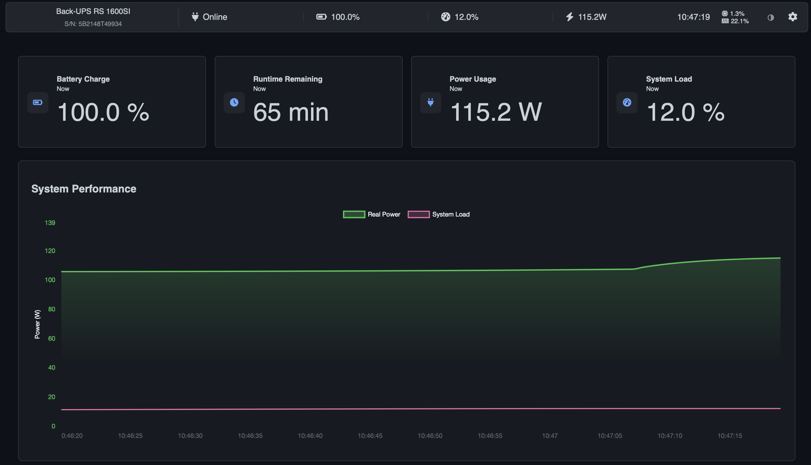
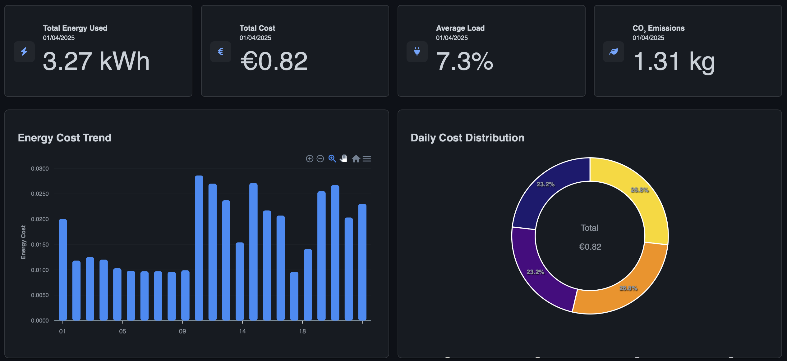
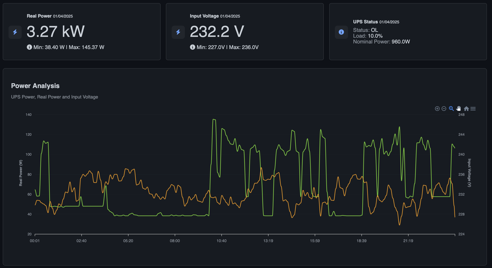
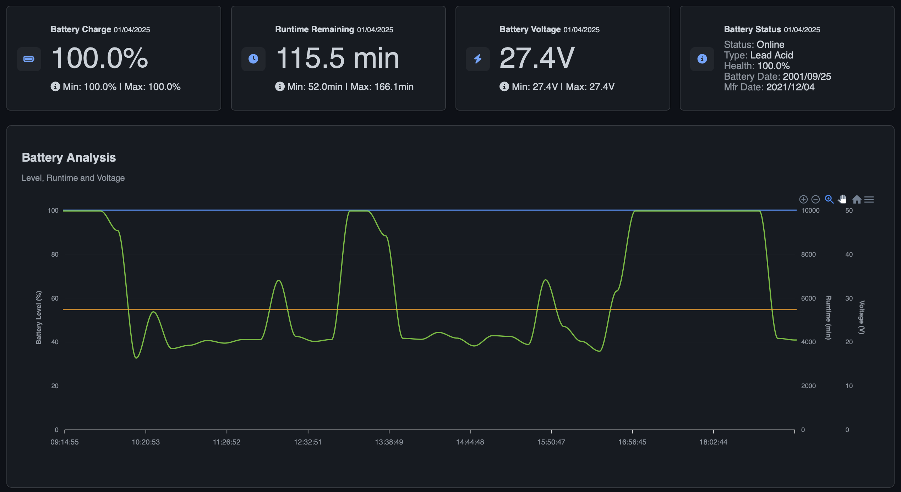
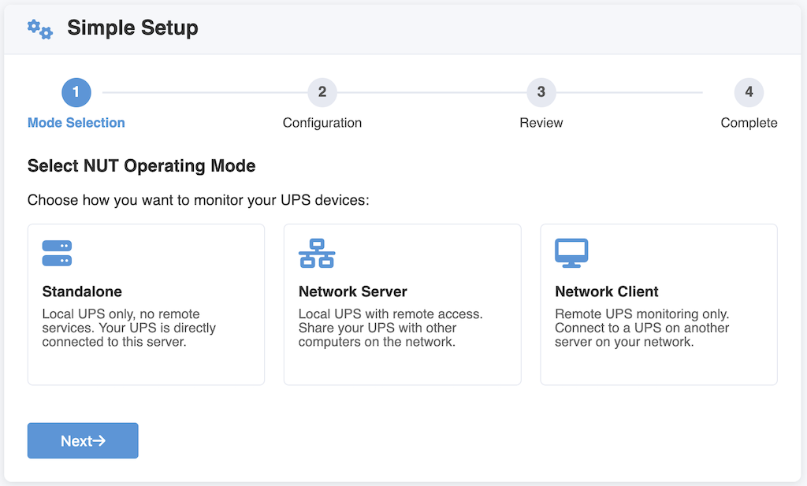
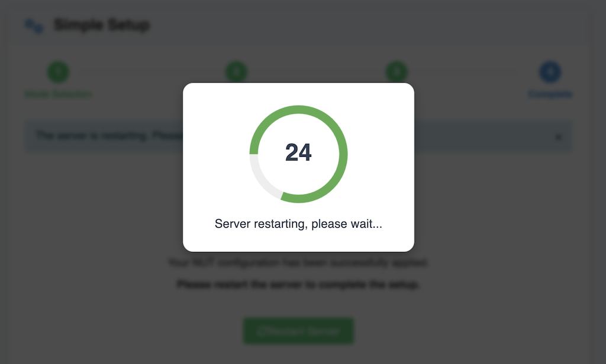
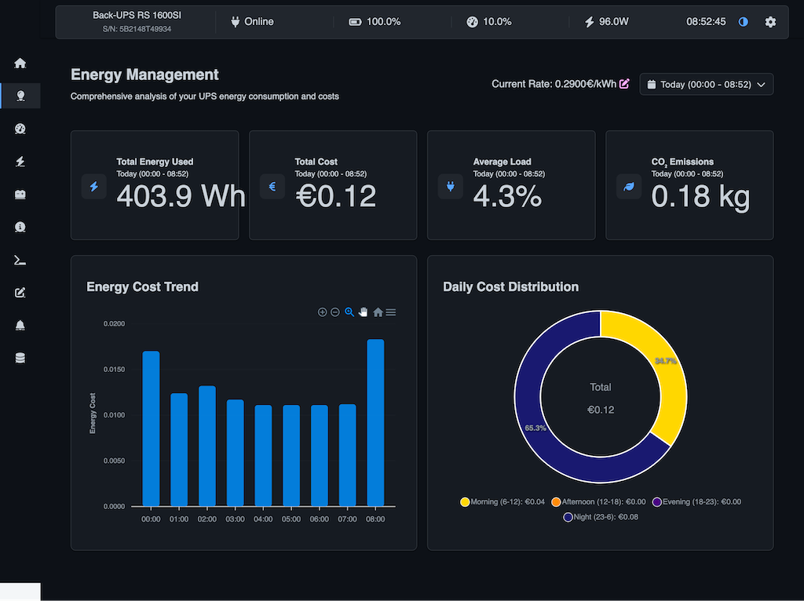
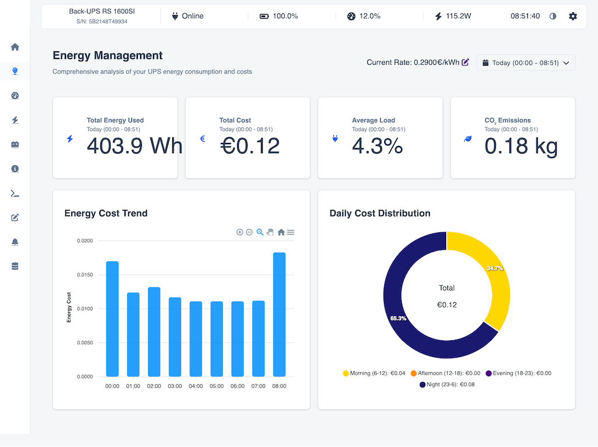

<p align="right">
<a href="https://www.buymeacoffee.com/DartSteven" target="_blank">
  
</a>
</p>

<div align="center">
  
</div>

<p align="center">
  <a href="https://buymeacoffee.com/DartSteven" target="_blank">
    
  </a>
  <a href="https://github.com/DartSteven/Nutify/discussions/42" target="_blank">
    
  </a>
  <a href="https://github.com/DartSteven/Nutify/wiki" target="_blank">
    
  </a>
  <a href="https://github.com/DartSteven/Nutify/blob/main/changelog.txt" target="_blank">
    
  </a>
  <a href="https://github.com/DartSteven/Nutify/discussions/46" target="_blank">
    
  </a>


<p align="center">Join our Discord channel for any issues, questions, information, or testing!</p>
<p align="center">
  <a href="https://discord.gg/mDAYVH9M" target="_blank">
    
  </a>
  <a href="https://discord.gg/mDAYVH9M" target="_blank">
    
  </a>
  <a href="https://discord.gg/mDAYVH9M" target="_blank">
    
  </a>
</p>

  
</p>

<p align="center"> If you like Nutify, please give it a ⭐️ on GitHub to help the project grow! </p>

# Nutify - UPS Monitoring System


Nutify is a comprehensive monitoring system designed to track the health and performance of your Uninterruptible Power Supply (UPS) devices. It provides real-time insights into critical UPS metrics, allowing you to ensure the continuous operation and protection of your valuable equipment. Nutify collects data, generates detailed reports, and visualizes key parameters through interactive charts, all accessible via a user-friendly web interface.


<p align="center">
  
  
</p>

<p align="center">
  
  
</p>


> **🆕 LATEST DOCKER IMAGES**  
> Use these tags to always get the latest version:  
> • AMD64/x86_64: `dartsteven/nutify:amd64-latest`  
> • ARM64/aarch64: `dartsteven/nutify:arm64-latest`  


> **📊 Is Nutify working with your UPS?**  
> Please share your experience in the [Discussions](https://github.com/DartSteven/Nutify/discussions) section under "Nutify UPS Compatibility List". Your feedback helps the community!

## Latest Version

**Current Version**: 0.1.7 (07/07/2025)

For a detailed list of changes and improvements, please see the [changelog.txt](changelog.txt) file.


⚠️ **IMPORTANT: Latest Updates in v0.1.7** ⚠️

Version 0.1.7 introduces significant improvements including:

- **User Authentication System:** Multi-user login with configurable permissions for individual pages and options
- **Enhanced Security:** Comprehensive permission system for all configuration areas
- **Improved Setup Wizard:** Fixed UI issues and enhanced user experience
- **System Stability:** Upgraded to NUT 2.8.3 and improved core architecture
- **Better Reporting:** Fixed time/battery reports with enhanced pandas integration

👉 **For detailed information on new features and migration, please see the [Nutify Wiki](https://github.com/DartSteven/Nutify/wiki).**


## Key Features

* **Real-time UPS Monitoring:** Continuously collects and displays data from your UPS devices
* **User Authentication System:** Multi-user login with granular permission control for individual pages and configuration areas
* **Detailed Reports:** Generates comprehensive reports on UPS performance with enhanced pandas integration
* **Interactive Charts:** Visualizes UPS data using interactive charts
* **Setup Wizard:** Enhanced configuration wizard with improved UI and navigation
* **Customizable Dashboards:** Provides a web-based dashboard to view real-time data
* **Data Persistence:** Stores historical UPS data in a SQLite database with improved schema
* **Dockerized Deployment:** Easily deployable using Docker and Docker Compose
* **Flexible Deployment Modes:** Run as a complete NUT server or as a lightweight client connecting to a remote NUT server
* **Robust Mode Detection:** Multi-layered CLIENT/SERVER mode detection with automatic fallback mechanisms
* **Enhanced Notification System:** Database-driven notifications with multiple channels (Email, Ntfy, Webhooks)
* **Discord Integration:** Send notifications directly to Discord channels
* **System Monitoring:** Real-time RAM and CPU usage widgets in the dashboard header
* **Multi-account Email Support:** Configure multiple email accounts for notifications with simplified provider setup
* **Energy Monitoring:** Detailed analysis of energy consumption
* **Battery Management:** Monitoring of battery status and performance
* **Event Management:** Logging and notification of UPS events
* **UPS Commands:** Interface to send commands to the UPS with permission control
* **Dark/Light Theme:** Customizable interface with both dark and light themes
* **Automated Reports:** Scheduled reports with detailed UPS status and improved accuracy
* **Push Notifications:** Integration with Ntfy for instant mobile alerts
* **Webhook Integration:** Flexible HTTP callbacks for third-party system integration
* **Advanced Configuration:** Fine-grained control over NUT settings and polling with user-based access

## Authentication Controls (Optional)

Nutify supports an environment variable to disable login entirely:

* `DISABLE_AUTH=true` to disable the login system (no login prompt, permissions bypassed).
* `SKIP_PERMCHECK=true` to skip USB permission changes (useful for rootless containers).

You can reset the primary admin password via the CLI (recommended if you lose access):

```bash
python -m core.auth.reset_admin_password --username admin
```

Omit `--username` to target the primary admin (ID 1) automatically, and omit `--password`
to be prompted securely in the terminal.
* **Connection Recovery:** Automatic reconnection and recovery from UPS communication failures
* **Optimized Event Handling:** Native Python integration with upsmon.conf for improved stability and responsiveness
* **WebSocket-based Real-time Data:** Efficient caching system significantly reducing CPU and RAM usage
* **Modular Architecture:** Extensible design with clean separation of concerns
* **Professional Branding:** Official logo and favicon for consistent identity across platforms
* **Expanded UPS Support:** Added drivers for a wider range of UPS models
* **Enhanced Security:** User authentication and permission system protecting configuration areas

## Quick Start

To run Nutify using Docker Compose:

1. Create a `docker-compose.yaml` file with the following minimal configuration:

```yaml
services:
  nut:
    image: dartsteven/nutify:arm64-latest  # Use amd64-latest or armv7-latest based on your architecture
    container_name: Nutify
    privileged: true
    cap_add:
      - SYS_ADMIN
      - SYS_RAWIO
      - MKNOD
    devices:
      - /dev/bus/usb:/dev/bus/usb:rwm
    device_cgroup_rules:
      - 'c 189:* rwm'
    volumes:
      - ./Nutify/logs:/app/nutify/logs
      - ./Nutify/instance:/app/nutify/instance
      - ./Nutify/ssl:/app/ssl
      - ./Nutify/etc/nut:/etc/nut
      - /dev:/dev:rw              # Full /dev access improves hotplug handling
      - /run/udev:/run/udev:ro    # Access to udev events
    environment:
    # - DISABLE_AUTH=true         # Disable the login system (no login prompt, permissions bypassed)
    # - SKIP_PERMCHECK=true       # Skip USB permission change for rootless implementations
      - SECRET_KEY=test1234567890 # for password encryption and decryption in the database
      - UDEV=1                    # Improve USB detection
    ports:
      - 3493:3493
      - 5050:5050
      - 443:443
    restart: always
    user: root
```

2. Start Nutify:
   ```bash
   docker-compose up -d
   ```

3. Access the Setup Wizard:
   Open your web browser and navigate to `http://localhost:5050`

4. Follow the Setup Wizard for initial configuration:
   - Select your **Timezone**.
   - Choose the **Operating Mode**: 
     - `SERVER` (Standalone): If the UPS is directly connected to this machine.
     - `CLIENT` (Netclient): If connecting to a remote NUT server.
   - Enter a **Name** for your UPS (e.g., `myups`).
   - Configure the connection details (driver, port, etc.). The wizard can attempt **Automatic Detection** or allow **Manual Configuration**.
   - Review your settings.
   - **Save & Restart** to apply the configuration.

## Web-Based Configuration

Nutify 0.1.6 introduces a new setup wizard that simplifies the entire configuration process. Instead of manually editing the docker-compose.yaml file, you can now:

1. **Start with minimal configuration**: Only a few environment variables are needed in docker-compose.yaml
2. **Access the web interface**: Navigate to the web UI after starting the container
3. **Follow the setup wizard**: Step-by-step configuration for your UPS setup
4. **Configure all settings via the UI**: No need to restart containers when changing settings

The setup wizard allows you to configure:
- UPS connection type (Standalone/Netwrok Server - Network Client)
- Manual Configuration or Auto-detect with nut-scanner
- Driver selection from the extensive list of supported drivers
- Connection parameters (hostname, port, etc.)


Here are some examples of the Setup Wizard screens:

<p align="center">
  
  
</p>


## Supported Architectures

Nutify is available for multiple hardware platforms:

| Architecture | Docker Image Tag | Devices |
|--------------|------------------|---------|
| 🖥️ **AMD64/x86_64** | `dartsteven/nutify:amd64-latest` | Standard PCs, servers, most cloud VMs |
| 🍓 **ARM64/aarch64** | `dartsteven/nutify:arm64-latest` | Raspberry Pi 4, Pi 400, Compute Module 4, Apple M1/M2 Macs |


You can also use specific version tags (e.g., `dartsteven/nutify:amd64-0.1.6`) if you need a particular version.

## Tested UPS Models

Nutify aims for broad compatibility with UPS devices supported by Network UPS Tools (NUT). 

**Is your UPS model working with Nutify but not listed here?** Please help us expand this list by sharing your experience in the

[UPS Compatibility List discussion](https://github.com/DartSteven/Nutify/discussions/category/general)

Knowing which models work helps the entire community.

While Nutify should work with most NUT-compatible devices, the models listed above have specific confirmation from users.

## Documentation [Nutify Wiki](https://github.com/DartSteven/Nutify/wiki)

For detailed documentation, including:
- Complete configuration options
- Advanced features
- Troubleshooting
- Screenshots and examples
- Technical details
- ... And More ...

## License

This project is licensed under the MIT License - see the LICENSE file for details.

## Screenshots


<p align="center">
  
  
  
</p>


## Support the Project

Nutify is developed and maintained in my free time. If you find this project useful and would like to support its continued development, please consider making a donation.

Your support helps cover development costs and encourages further improvements and new features. Thank you for your generosity!

<p align="center">
  <a href="https://www.blockchain.com/btc/address/bc1qprc948hf49s88cyfhennj5yaafewr8vat9qrk9" target="_blank">
    
  </a>
  &nbsp;&nbsp;
<a href="https://www.buymeacoffee.com/DartSteven" target="_blank">
  
</a>
  </a>
</p>

## Stargazers over time
[](https://starchart.cc/DartSteven/Nutify)
